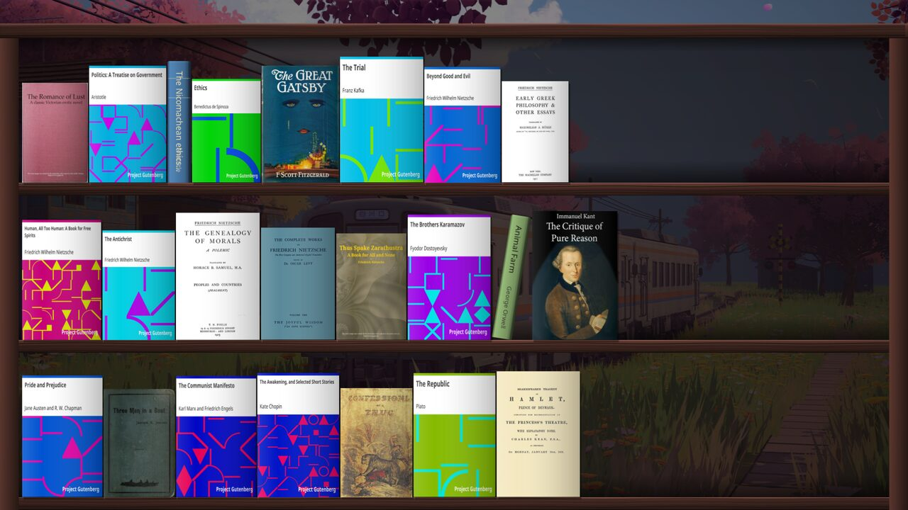

<p align="center">
  
</p>

<h1 align="center">Almari</h1>

A bookshelf that *is* your desktop. Almari draws a wooden bookcase on the
Wayland background layer, stands your epub library on its shelves — spines,
covers, or a mix — and opens any book into a full reading view when you click
it. It is a wallpaper you can read.

*almari* (الماری / अलमारी) — the cupboard or bookcase that stands against the
wall of a room.

Built for Hyprland with GTK4 and `wlr-layer-shell`.

> **Almari is recommended only alongside [end-4's illogical-impulse](https://github.com/end-4/dots-hyprland).**
> That is the setup it is built for and the only one it is tested on: the
> shell starts and stops it, gives it global shortcuts and a page in the
> settings app, steps its own wallpaper and panel aside for the shelf, and
> hands it the current wallpaper and colour palette. Almari will run under
> plain Hyprland, but you will be wiring up autostart, keybinds and theming
> by hand, and nothing outside illogical-impulse is tested.

[](https://github.com/qahrindustries/Almari/actions/workflows/tests.yml)
[](LICENSE)

**[Installation and usage guide →](https://qahrindustries.github.io/Almari/)**




## What it does

- **Reads your library.** Point it at a folder; every `.epub` under it becomes
  a book. Cover art, title, author and spine colour are taken from the file —
  spine colour from the cover, thickness from the file size.
- **Draws a real bookcase.** Planks, uprights, a top beam, shadows under each
  shelf, and a last book on a part-filled shelf that leans back onto its
  neighbour with its base out in the gap, the way a real one does.
- **Opens books in place.** Clicking a book turns the wallpaper into a reader:
  chapters, a table of contents, search, remembered position and a progress
  bar. No separate window, no application to alt-tab to.
- **Stays out of the way.** It lives below every window. Your desktop is only
  a bookshelf when nothing is covering it.

## Install

Start with illogical-impulse — [install it first](https://end-4.github.io/dots-hyprland-wiki/en/ii-qs/01setup/)
if you have not — then:

```sh
git clone https://github.com/qahrindustries/Almari
cd Almari
./install.sh
```

Dependencies: `gtk4`, `gtk4-layer-shell`, `python-gobject`, `python-cairo`.
`install.sh` will fetch them with pacman on Arch if they are missing; on
other distributions install the equivalents yourself and re-run it. It also
installs the icon and a desktop entry, so re-running it to pick up a new
version is safe.

Then point it at your books and start it:

```sh
almari --dir ~/Books --mode bg
```

To have it come back after a reboot, add it to your compositor's autostart:

```conf
# hyprland.conf
exec-once = ~/.local/bin/almari --mode bg
```

Kill `hyprpaper` / `swww` first — they compete for the same layer.

## Using it

Everything happens on the shelf itself. There is no toolbar and no gear icon.

| Action | What it does |
| --- | --- |
| Click a book | Open it |
| Double-click anywhere | Settings |
| Drag a book | Rearrange the shelves |
| Right-click a book | Its details, progress, and how it should stand |
| `Esc`, or a click outside a card | Close the card |

A single click waits out the double-click interval before it opens anything,
so a double-click meant for the settings never opens a book on the way past.

### Reading

| Key | |
| --- | --- |
| `←` `→` / `Space` | Turn the page |
| `↑` `↓` / `j` `k` | Scroll a line |
| `n` `p` | Next / previous chapter |
| `t` | Contents |
| `/` or `Ctrl-F` | Find in book |
| `+` `−` `Ctrl-0` | Text size |
| `Home` `End` | Start / end of chapter |
| `Esc` | Close the find bar, then the contents, then the book |

Turning a page lands on exactly the line the last screen ran out on — the page
is advanced to a real line boundary rather than by a fixed fraction of the
viewport, so nothing is ever repeated or skipped.

Your position in every book is remembered in `~/.cache/almari/progress.json`,
and the right-click card shows how far through each one you are.

### Per-book views

Right-clicking a book lets that one book ignore the shelf-wide display mode:

- **Auto** — follow the shelf setting
- **Cover** — stand face out
- **Spine** — stand spine out
- **Tilted** — lean

A book only ever leans onto something that can hold it up: the book beside it,
or the case wall. One with nothing to rest against stands upright, because
leaning into open air is what a book does on its way to lying flat, not a pose
it holds. The choice is saved, so it survives a restart.

### The wall behind the shelves

The bookcase can stand against a flat colour or against your desktop
wallpaper. Wallpaper mode keeps the app exactly as it is and simply shows the
picture through the case, dimmed enough that spines stay readable.

## Settings

All of them live in the card you get by double-clicking, and all of them are
written straight to `~/.config/almari/config.json`.

| Key | |
| --- | --- |
| `books_dir` | Scanned recursively for `.epub` |
| `display` | `spine`, `cover` or `mixed` |
| `face_out_every` | In `mixed`: every Nth book stands face out. `0` disables |
| `scale` | Book and shelf size |
| `sort` | `author`, `title`, `random` or `custom` (what dragging sets) |
| `book_order` | The dragged arrangement, as a list of paths |
| `book_states` | Per-book view overrides, keyed by path |
| `tilt_books` | Whether books lean at all |
| `tilt_angle` | How far, in degrees. Clamped to the room actually beside the book |
| `wall_mode` | `color` or `wallpaper` |
| `wallpaper_path`, `wallpaper_dim` | The picture, and how far it is darkened |
| `reader_full_width` | Full-bleed text, or a capped measure |
| `reader_width` | The measure, in characters, when not full width |
| `reader_font`, `reader_font_size`, `reader_line_height`, `reader_justify` | Typography |
| `theme_from_shell` | Follow illogical-impulse's generated Material palette |
| `layer_shell` | `bottom` (default), `background` or `top` |
| `open_cmd` | External reader, for "Open elsewhere" |

Colours (`wall`, `wood`, `reader_*`) are derived from the shell palette while
`theme_from_shell` is on, and are not written back to the config so that
retheming keeps working.

## Controlling it

`almari ctl <command>` talks to the running instance over a socket. It
short-circuits before GTK is imported, so it is cheap enough to bind to a key.

```sh
almari ctl toggle-reader          # open/close the last book read
almari ctl open "Animal Farm"     # by title or path fragment
almari ctl random
almari ctl settings               # open the settings card
almari ctl wallpaper toggle       # wallpaper behind the shelves
almari ctl book-state tilt "Animal Farm"
almari ctl set scale 1.4
almari ctl get                    # the whole config, as JSON
almari ctl state                  # what it is doing right now
almari ctl version                # which build is on screen
almari ctl rescan
almari ctl quit
```

The library folder, the config file and the shell palette are all watched, so
adding a book or editing a setting takes effect without a restart.
`pkill -USR1 -f almari` forces a rescan, `-USR2` a config reload.

## quickshell / illogical-impulse

`quickshell/` holds the integration. `services/Almari.qml` starts and stops
Almari with the shell, exposes global shortcuts, and pushes the two things
only the shell knows: which wallpaper is current, and whether the shelves
should stand in front of it.

It deliberately does **not** mirror Almari's own settings. Almari's
`config.json` is the single owner of them, so a setting changed in the card
survives a login instead of being overwritten by the shell's stale copy.

Copy `services/Almari.qml` into your quickshell config, and merge the two
snippets under `modules/` into `Config.qml` and the background settings page.

## Tests

```sh
./tests/run.sh                       # everything
./tests/run.sh ~/Books/some.epub     # …with the reader tested against a real book
```

| Suite | |
| --- | --- |
| `test_shelf.py` | layout, tilt, hit-testing, drop targets |
| `test_interaction.py` | click / double-click / drag, cards, state |
| `test_wiring.py` | gestures and overlays, in a real window |
| `test_cards.py` | the cards answer the mouse and stay on screen |
| `test_reader.py` | paging lands on whole lines; typography |

They need GTK but not a compositor; the ones that need a book write
themselves a small epub if you have not named one, so a fresh clone can
check itself.

## Cache

`~/.cache/almari/` holds extracted covers, the metadata index and reading
progress. Deleting it is safe; the covers are rebuilt on the next scan.

## Upgrading from shelfwall

Almari was called shelfwall. On first run it copies
`~/.config/shelfwall/config.json` and `~/.cache/shelfwall/` across, so the
library, the arrangement and every reading position come with it. The old
files are left alone; remove them once you are satisfied, along with
`~/.local/bin/shelfwall`.

If you use the quickshell integration, replace `services/Bookshelf.qml` with
`services/Almari.qml` and rename `bookshelf` to `almari` in two places: the
block in `Config.qml`, and the `background.bookshelf` key in
`~/.config/illogical-impulse/config.json` (setting `command` to `almari`
while you are there). Renaming the saved key keeps the shell's enabled and
wallpaper-behind settings; leaving it behind quietly starts you from the
defaults.

## Licence

Apache 2.0. See [LICENSE](LICENSE).
